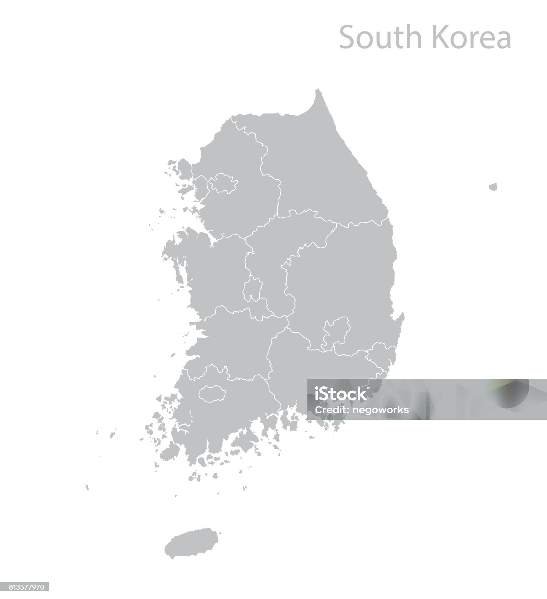
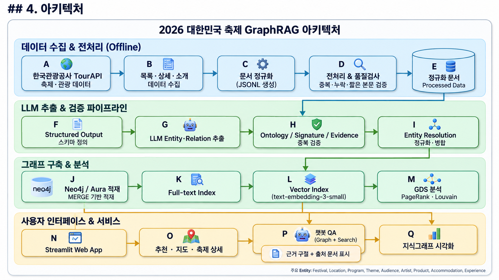

# Festival Knowledge Graph

> 한 줄 소개: 한국관광공사 축제·관광 데이터를 전처리하고, **LLM 기반 Entity·Relation 추출과 Entity Resolution**을 거쳐 Neo4j Knowledge Graph를 구축합니다. 검색 인덱스와 그래프 분석을 통해 축제·장소·프로그램·테마·숙박·체험 간의 관계를 탐색할 수 있습니다.

📚 종합 리포트: [프로젝트 평가 리포트](docs/report.md)

📋 데이터 명세: [데이터 수집 명세서](docs/data_collection_spec.md)

---

## 1. 프로젝트 소개

- **문제**: 축제 정보가 목록·소개·상세·주변 관광 데이터로 나뉘어 있어 축제와 장소, 프로그램, 대상, 테마 사이의 관계를 한 번에 탐색하기 어렵습니다.

- **해결**: 한국관광공사 관광정보 API 데이터를 문서로 정규화하고, LLM을 활용해 Entity와 Relation을 추출합니다. 이후 온톨로지 검증과 Evidence 검증, Entity Resolution을 수행하여 Neo4j 기반 Knowledge Graph로 통합합니다.

- **범위**: 2026년 축제 데이터 700건과 체험관광·숙박·주변 관광 데이터를 활용합니다.

---

## 2. 데모

현재 데모 앱은 Streamlit Cloud에서 제공되며, 축제 탐색·추천·지도·상세 정보·챗봇·지식그래프 화면으로 구성되어 있습니다.




---

## 3. 주요 기능

### 데이터 수집 및 전처리

- 한국관광공사 관광정보 API 기반 축제 데이터 수집
- 축제 목록·소개·상세정보 결합
- 체험관광·숙박·축제 주변 관광정보 추가 수집
- 문서 ID 중복, 본문 누락, 짧은 본문 및 전처리 Reject 검증
- 원천 식별자와 출처 메타데이터 보존

### LLM 기반 지식 추출

- 구조화 출력 기반 Entity·Relation 추출
- 축제, 장소, 프로그램, 테마, 대상, 아티스트, 상품 등 Entity 생성
- `HELD_IN`, `HAS_PROGRAM`, `HAS_THEME`, `TARGETS`, `ORGANIZES` 등의 Relation 생성
- 원문 Evidence와 `source_doc_id` 보존
- 추출 실패 시 재시도 및 raw 응답 저장

### 온톨로지 및 품질 검증

- Entity Type 허용 목록 검증
- Subject·Relation·Object Signature 검증
- 관계 방향 검증
- Evidence 원문 포함 여부 검증
- 중복 Triple 검출 및 Reject 사유 집계

### Entity Resolution

- Entity Type·canonical name 기반 중복 후보 생성
- 문자열·문맥·임베딩 기반 후보 비교
- 승인된 병합 후보를 반영한 Entity 정규화
- 병합 전후 Entity 수와 후보 승인·거부 결과 저장

### Neo4j 및 그래프 분석

- Entity Type별 노드와 Ontology 방향에 맞는 관계 생성
- 관계에 `source_doc_id`, `evidence`, 거리 정보 보존
- `MERGE` 기반 중복 방지 적재
- Full-text·Vector Index 구축
- PageRank Hub 10개와 Louvain Community Detection 수행

---

## 4. 아키텍처



---

## 5. 기술 스택

| 구분 | 사용 기술 | 활용 |
|---|---|---|
| 언어·환경 | Python 3.12, uv | 개발 환경 및 의존성 관리 |
| 데이터 수집 | Python Requests, 한국관광공사 TourAPI | 축제·관광 데이터 수집 |
| 데이터 처리 | JSON, JSONL, Pydantic | 문서 정규화와 스키마 검증 |
| LLM | LangChain, OpenAI Structured Output | Entity·Relation 추출 |
| Embedding | `text-embedding-3-small` | Vector 검색과 Entity 후보 비교 |
| Graph DB | Neo4j, Neo4j Aura | 노드·관계 저장 및 Cypher 조회 |
| Graph Analysis | Neo4j GDS | PageRank, Louvain Community Detection |
| 검색 | Neo4j Full-text·Vector Index | 키워드 및 의미 기반 검색 |
| 시각화 | Graphviz, Plotly | 그래프 관계 시각화 |
| 버전 관리 | GitHub | 브랜치·협업·형상 관리 |

### 주요 기술 선정 기준

- **Neo4j**: Entity와 Relation을 그래프 형태로 저장하고 Cypher 및 GDS 분석을 수행하기 위해 선택했습니다.
- **Structured Output**: LLM 출력이 정해진 Entity·Relation 스키마를 따르도록 하여 후속 검증과 적재를 안정화했습니다.
- **Entity Resolution**: 서로 다른 표현의 동일 Entity를 canonical name 기준으로 통합하기 위해 적용했습니다.
- **Full-text·Vector Index**: 정확한 키워드 검색과 의미 기반 검색을 함께 지원하기 위해 사용했습니다.

## 6. 데이터

### 수집 범위

| 데이터 | 건수 | 주요 용도 |
|---|---:|---|
| 축제 기본 데이터 | 700 | Festival 노드 생성 |
| 축제 소개 데이터 | 700 | 축제 본문 및 Evidence 구성 |
| 축제 상세 데이터 | 700 | 프로그램·장소·대상 관련 본문 구성 |
| 체험관광 데이터 | 1,835 | Experience 노드 및 주변 정보 |
| 숙박 데이터 | 3,004 | Accommodation 노드 및 주변 정보 |
| 축제 주변 데이터 | 700개 축제 기준 | `NEARBY` 관계 생성 |

### 주요 필드

- 식별: `contentid`, `source_doc_id`, `contenttypeid`
- 명칭: `title`, `festival_title`
- 위치: `addr1`, `addr2`, `areacode`, `sigungucode`, `mapx`, `mapy`
- 일정: `eventstartdate`, `eventenddate`
- 본문: `intro`, `info`, `overview`
- 부가정보: `firstimage`, `firstimage2`, `tel`, `zipcode`
- 출처·저작권: `cpyrhtDivCd`, `source_file`

### 전처리 결과

- 원천 문서: 700건
- 최종 문서: 700건
- 중복 문서 ID: 0건
- 전처리 Reject: 0건
- 소개 데이터 누락: 0건
- 상세정보 데이터 누락: 1건

상세한 출처·수집 API·필드·결측·라이선스 확인사항은 [데이터 수집 명세서](docs/data_collection_spec.md)를 참고하세요.

## 7. Knowledge Graph 스키마

### Entity Type

```text
Festival, Location, Organization, Program, Theme,
Audience, Artist, Product, Accommodation, Experience
```

### 주요 Relation

| Subject | Relation | Object | 의미 |
|---|---|---|---|
| Festival | `HELD_IN` | Location | 축제가 특정 장소에서 개최됨 |
| Festival | `TARGETS` | Audience | 축제가 특정 대상을 대상으로 함 |
| Festival | `HAS_PROGRAM` | Program | 축제가 프로그램을 포함함 |
| Festival | `HAS_THEME` | Theme | 축제가 특정 주제와 관련됨 |
| Festival | `FEATURES` | Artist | 축제에 아티스트가 참여함 |
| Festival | `PROVIDES` | Product | 축제가 상품을 제공함 |
| Organization | `ORGANIZES` | Festival | 기관이 축제를 주최함 |
| Program | `HELD_IN` | Location | 프로그램이 특정 장소에서 진행됨 |
| Program | `TARGETS` | Audience | 프로그램이 특정 대상을 대상으로 함 |
| Festival | `NEARBY` | Accommodation / Experience | 축제 주변 숙박·체험 정보 |

온톨로지 원본은 [`src/extraction/ontology.py`](src/extraction/ontology.py)에 있습니다.

## 8. 주요 평가 결과

### 8.1 Triple 품질 평가

| 평가 항목 | 결과 | 의미 |
|---|---:|---|
| 추출 Triple | 13,470건 | LLM이 추출한 전체 Triple |
| 검증 통과 Triple | 13,302건 | Schema·Entity·Relation·Evidence 검증 통과 |
| Ontology 준수율 | **98.75%** | 허용된 Entity Type·Relation Signature 비율 |
| Evidence 자동 검증 통과 추정치 | **99.75%** | Evidence가 원문에 존재하는지 자동 확인한 비율 |
| Triple Sample Precision | **83.33% (45/54)** | 수동 검토 샘플에서 Subject·Relation·Object·Evidence가 모두 적절한 비율 |

### 8.2 Entity Resolution 평가

| 평가 항목 | 결과 | 의미 |
|---|---:|---|
| ER 전 Entity | 12,900개 | 병합 전 Entity 수 |
| ER 후 Entity | 12,804개 | 병합 후 정규화된 Entity 수 |
| Entity 감소 | 96개 | 최종 중복 Entity 감소분 |
| 승인된 병합 후보 | 261쌍 | 병합 대상으로 승인된 후보 쌍 |
| 거부된 병합 후보 | 113쌍 | 병합하지 않기로 판단한 후보 쌍 |
| 전체 검토 결정 | 375건 | 승인·거부 후보 합계 |

### 8.3 Neo4j 적재 및 Graph Analysis

| 평가 항목 | 결과 | 의미 |
|---|---:|---|
| Neo4j Node | 24,185건 처리 | 적재 시 처리한 전체 노드 수 |
| Neo4j Relationship | 51,937건 | 최종 그래프 관계 수 |
| 적재 실패 배치 | **0건** | 배치 적재 실패 건수 |
| PageRank Top 결과 | 10건 | 연결 중심성이 높은 Hub Entity |
| Louvain Community | 5,208개 | 그래프 구조에서 탐지된 Community 수 |

Triple Precision은 수동 검토 샘플 기준이며 전체 Triple의 전수 정밀도가 아닙니다. ER Golden Set 기반 재현율·오병합 정량 평가는 별도 선택 평가 항목으로 관리했습니다.

## 9. 실행 방법

### 사전 준비

- Python 3.12 이상
- [uv](https://docs.astral.sh/uv/)
- Neo4j 또는 Neo4j Aura
- 데이터 수집·LLM 추출·임베딩 사용 시 API Key

### 설치

```bash
git clone https://github.com/encore-ai-campus/mle-01-p2-team1
cd mle-01-p2-team1
uv sync
```

### 환경변수

`.env`는 커밋하지 않습니다.

```env
TOUR_API_SERVICE_KEY=your_tour_api_key
OPENAI_API_KEY=your_openai_api_key
NEO4J_URI=neo4j+s://<instance-id>.databases.neo4j.io
NEO4J_USER=neo4j
NEO4J_PASSWORD=your_password
```

Aura 적재 작업에서는 다음 별칭을 사용할 수 있습니다.

```env
AURA_URI=neo4j+s://<instance-id>.databases.neo4j.io
AURA_USER=neo4j
AURA_PASSWORD=your_password
```

### 테스트

```bash
uv run pytest
```

## 10. 프로젝트 구조

```text
mle-01-p2-team1/
├── README.md
├── pyproject.toml
├── uv.lock
├── assets/
├── data/
│   ├── raw/                         # 원천 축제 데이터
│   ├── extra/                       # 숙박·체험·주변 데이터
│   └── processed/
│       ├── 01_preprocessing/        # 정규화 문서
│       ├── 02_extraction/           # 추출·검증 Triple
│       ├── 03_er/                   # Entity Resolution 결과
│       ├── 04_graph/                # Neo4j 적재 데이터
│       └── 05_reports/              # 품질·적재·분석 리포트
├── docs/
│   ├── data_collection_spec.md
│   ├── report.md
│   └── JSON_METADATA_REPORT.md
├── scripts/
│   ├── build_vector_indexes.py
│   └── run_qa_gold.py
├── src/
│   ├── collection/                  # 데이터 수집
│   ├── preprocessing/               # 전처리
│   ├── extraction/                  # LLM 추출·온톨로지·검증
│   ├── entity_resolution/           # Entity 병합
│   ├── graph/                       # Neo4j·인덱스·GDS 분석
│   ├── rag/                         # 검색·Text2Cypher·답변
│   └── ui/                          # UI 모듈
└── tests/                           # 단위·통합 테스트
```

## 11. 주요 산출물

- [종합 평가 리포트](docs/report.md)
- [데이터 수집 명세서](docs/data_collection_spec.md)
- [JSON 메타데이터 리포트](docs/JSON_METADATA_REPORT.md)
- [전처리 리포트](data/processed/05_reports/preprocessing_report.json)
- [Triple 검증 리포트](data/processed/05_reports/validation_summary_v2.json)
- [Neo4j 적재 리포트](data/processed/05_reports/load_report.json)
- [Aura 적재 리포트](data/processed/05_reports/aura_load_report.json)
- [검색 인덱스 리포트](data/processed/05_reports/index_report.json)
- [Graph Analysis 리포트](data/processed/05_reports/graph_analysis_report.json)

> 원천 데이터의 공개·재배포 시에는 한국관광공사 및 공공데이터 제공 조건과 API 이용약관을 확인해야 합니다. 원천 응답의 `cpyrhtDivCd` 필드는 데이터에 보존되어 있습니다.
